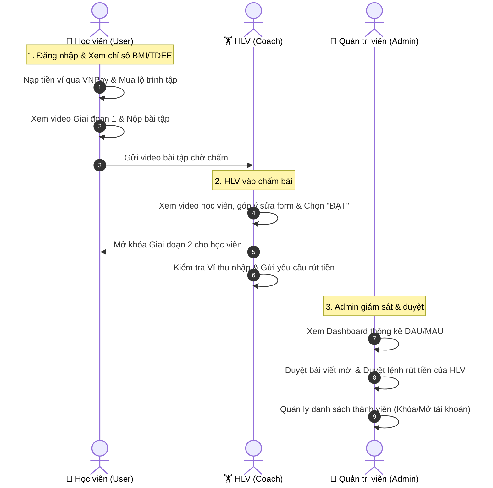

# 🎓 CẨM NANG HƯỚNG DẪN BẢO VỆ ĐỒ ÁN TỐT NGHIỆP — FITVIBE
> **Đề tài:** Xây dựng Nền tảng Quản lý Luyện tập, Dinh dưỡng & Kết nối Huấn luyện viên Cá nhân Trực tuyến (**FitVibe**)  
> **Tác giả:** Sinh viên thực hiện  
> **Thời gian thuyết trình chuẩn:** 10 – 15 phút  

---

## 📌 MỤC LỤC
1. [Thông điệp cốt lõi & Giới thiệu nhanh (Elevator Pitch)](#1-thông-điệp-cốt-lõi--giới-thiệu-nhanh-elevator-pitch)
2. [Cấu trúc Slide thuyết trình chuẩn 10-12 Slide](#2-cấu-trúc-slide-thuyết-trình-chuẩn-10-12-slide)
3. [Kịch bản thuyết trình chi tiết từng phút (Speech Script)](#3-kịch-bản-thuyết-trình-chi-tiết-từng-phút-speech-script)
4. [Kịch bản LIVE DEMO mượt mà (Step-by-Step)](#4-kịch-bản-live-demo-mượt-mà-step-by-step)
5. [Điểm sáng công nghệ & Nghiệp vụ nổi bật (Highlights)](#5-điểm-sáng-công-nghệ--nghiệp-vụ-nổi-bật-highlights)
6. [Bộ câu hỏi phản biện của Hội đồng & Cách trả lời đạt điểm 10](#6-bộ-câu-hỏi-phản-biện-của-hội-đồng--cách-trả-lời-đạt-điểm-10)
7. [Bí quyết tâm lý & Tác phong khi đứng trước Hội đồng](#7-bí-quyết-tâm-lý--tác-phong-khi-đứng-trước-hội-đồng)

---

## 1. THÔNG ĐIỆP CỐT LÕI & GIỚI THIỆU NHANH (ELEVATOR PITCH)

> *"FitVibe là một hệ sinh thái thể hình & dinh dưỡng toàn diện (All-in-One Fitness Platform) giúp giải quyết triệt để 3 vấn đề lớn của người tập hiện nay:*
> 1. *Cá nhân hóa lộ trình tập luyện & dinh dưỡng dựa trên chỉ số sinh học (BMI, BMR, TDEE).*
> 2. *Tương tác thực tế với Huấn luyện viên qua cơ chế **Nộp video chấm điểm động tác & mở khóa lộ trình tuần tự**.*
> 3. *Tạo môi trường kinh doanh số cho Huấn luyện viên thông qua **Ví thu nhập & Rút tiền ngân hàng**, tích hợp cổng nạp tiền **VNPay**."*

---

## 2. CẤU TRÚC SLIDE THUYẾT TRÌNH CHUẨN (10 - 12 SLIDE)

* **Slide 1: Trang bìa**  
  * Tên đề tài, Tên sinh viên, MSSV, Tên Giảng viên hướng dẫn, Logo trường.
* **Slide 2: Đặt vấn đề & Tính cấp thiết của đề tài**  
  * Thực trạng nhu cầu rèn luyện sức khỏe tăng cao nhưng tập sai kỹ thuật, ăn uống thiếu khoa học.
  * Khoảng cách giữa người tập tự do và HLV chuyên nghiệp (chi phí thuê PT trực tiếp quá cao).
* **Slide 3: Mục tiêu & Đối tượng nghiên cứu**  
  * Xây dựng nền tảng đa vai trò: **Học viên (User)**, **Huấn luyện viên (Coach)**, **Quản trị viên (Admin)**.
* **Slide 4: Kiến trúc hệ thống & Công nghệ sử dụng**  
  * Sơ đồ Client - Server - Database - Third Party (VNPay, AI, Storage).
  * Frontend: Next.js 16, React 19, TypeScript, Tailwind CSS.
  * Backend: Node.js, Express 5, MySQL2 Connection Pool, JWT, Multer.
  * Triển khai: Docker Compose.
* **Slide 5: Phân hệ Học viên (User) — Trải nghiệm cá nhân hóa**  
  * Tính toán chỉ số sinh trắc học (BMI, BMR, TDEE).
  * Nhật ký cân nặng & Biểu đồ tiến độ.
  * Lộ trình tập luyện tuần tự (Sequential Progression) + Thực đơn theo ngày.
  * Nộp video bài tập để HLV sửa form.
  * Nạp tiền ví qua VNPay, Tư vấn viên AI.
* **Slide 6: Phân hệ Huấn luyện viên (Coach) — Kinh doanh & Chuyên môn**  
  * Thiết kế lộ trình nhiều giai đoạn (Stages) kèm Video & Dinh dưỡng.
  * Quản lý học viên, chấm điểm video bài tập (Pass/Fail + Góp ý).
  * Hồ sơ chứng chỉ quốc tế (NASM, ACE, ACSM, ISSA).
  * Ví thu nhập & Yêu cầu rút tiền ngân hàng.
* **Slide 7: Phân hệ Quản trị viên (Admin) — Giám sát & Vận hành**  
  * Bảng điều khiển phân tích tăng trưởng (DAU/MAU, Doanh thu).
  * Quản trị thành viên, Phân quyền RBAC, Khóa/Mở tài khoản.
  * Kiểm duyệt bài viết HLV, Phê duyệt lệnh rút tiền, Quản lý danh mục.
* **Slide 8: Quy trình nghiệp vụ tiêu biểu (Sơ đồ luồng)**  
  * Luồng học tập & mở khóa giai đoạn.
  * Luồng nạp ví VNPay $\rightarrow$ Mua khóa học $\rightarrow$ Rút tiền về ngân hàng.
* **Slide 9: VIDEO / TRÌNH DIỄN DEMO TRỰC TIẾP** (Live Demo trên trình duyệt).
* **Slide 10: Kết quả đạt được & So sánh với các giải pháp hiện có**  
  * Hoàn thành 100% các chức năng cốt lõi theo đề cương.
  * Giao diện responsive, UX mượt mà, phân quyền bảo mật chặt chẽ.
* **Slide 11: Hướng phát triển tương lai**  
  * Tích hợp đồng hồ thông minh (Apple Health / Google Fit).
  * AI Computer Vision nhận diện form động tác trực tiếp qua camera.
  * Mobile App (React Native).
* **Slide 12: Lời cảm ơn & Q&A**  
  * Lời cảm ơn Hội đồng & sẵn sàng nhận câu hỏi phản biện.

---

## 3. KỊCH BẢN THUYẾT TRÌNH CHI TIẾT TỪNG PHÚT (SPEECH SCRIPT)

### ⏱️ Phút 0:00 - 1:30 | Lời chào & Đặt vấn đề
> *"Kính thưa Thầy/Cô Chủ tịch Hội đồng và toàn thể quý Thầy/Cô trong Hội đồng chấm đồ án tốt nghiệp!*
>
> *Em tên là **[Họ và Tên]**, sinh viên lớp **[Tên lớp]**, Khoa **[Khoa Công nghệ Thông tin]**.*
>
> *Hôm nay, em rất vinh dự được trình bày đề tài đồ án tốt nghiệp của mình: **'Nghiên cứu và Xây dựng Nền tảng Quản lý Luyện tập, Dinh dưỡng & Kết nối Huấn luyện viên Cá nhân Trực tuyến FitVibe'** dưới sự hướng dẫn của **[Thầy/Cô hướng dẫn]**.*
>
> *Xuất phát từ thực tế hiện nay, ngày càng có nhiều người quan tâm đến việc rèn luyện thể chất và cải thiện vóc dáng. Tuy nhiên, đa số người tập tự do gặp phải 3 rào cản lớn:*
> 1. *Không biết cơ thể mình cần bao nhiêu calo, dẫn đến tập nhiều nhưng không hiệu quả hoặc bị chấn thương do sai kỹ thuật.*
> 2. *Chi phí thuê Huấn luyện viên cá nhân (PT) trực tiếp tại phòng gym quá cao, không phải ai cũng có điều kiện tiếp cận.*
> 3. *Các ứng dụng hiện tại thường chỉ cung cấp video một chiều, thiếu tính tương tác, không có ai kiểm tra xem người tập có làm đúng tư thế hay không.*
>
> *Chính vì lý do đó, em đã nghiên cứu và phát triển **FitVibe** — một nền tảng chuyển đổi số toàn diện kết nối người tập, huấn luyện viên và nhà quản lý."*

---

### ⏱️ Phút 1:30 - 3:00 | Kiến trúc hệ thống & Công nghệ
> *"Về kiến trúc kỹ thuật, FitVibe được xây dựng theo mô hình Full-stack hiện đại, phân tách rõ ràng và đóng gói toàn bộ trong môi trường **Docker Compose** bao gồm 3 dịch vụ:*
>
> 1. **Frontend:** Được xây dựng trên nền tảng **Next.js 16 (App Router)** kết hợp **React 19** và **TypeScript**. Giao diện ứng dụng sử dụng **Tailwind CSS** và **shadcn/ui** với tông màu Mint/Emerald trẻ trung, tối ưu hóa tốc độ tải trang và trải nghiệm người dùng trên mọi thiết bị.
> 2. **Backend:** Xây dựng bằng **Node.js & Express 5**, áp dụng kiến trúc phân tầng (Routes - Controllers - Middleware - Database Pool). Hệ thống sử dụng **JWT (JSON Web Token)** để xác thực và phân quyền theo mô hình **RBAC (Role-Based Access Control)**.
> 3. **Database:** Sử dụng **MySQL 8.0** với chuẩn mã hóa `utf8mb4_unicode_ci`, thiết kế chuẩn hóa quan hệ giữa Người dùng, Lộ trình, Bài nộp video, Giao dịch ví.
> 4. **Tích hợp bên thứ ba:** Tích hợp cổng thanh toán trực tuyến **VNPay Sandbox** và Trợ lý ảo AI tư vấn dinh dưỡng."*

---

### ⏱️ Phút 3:00 - 6:30 | Các phân hệ chức năng chính
> *"FitVibe cung cấp quy trình nghiệp vụ khép kín cho 3 nhóm đối tượng:*
>
> 🔹 **Thứ nhất - Phân hệ Học viên (User):**
> - Ngay khi tạo tài khoản, hệ thống sẽ tự động tính toán các chỉ số sinh học quan trọng gồm **BMI**, **BMR** và mức tiêu hao calo mỗi ngày **TDEE** dựa trên công thức khoa học Mifflin-St Jeor.
> - Học viên theo dõi nhật ký cân nặng qua biểu đồ trực quan; khám phá kho bài viết tập luyện và chế độ ăn (Eat Clean, Keto...).
> - **Điểm đặc biệt nhất là Lộ trình tập luyện tuần tự (Sequential Progression):** Học viên đăng ký lộ trình, xem video hướng dẫn và thực đơn theo từng ngày, sau đó **quay video bài tập gửi lên hệ thống** để Huấn luyện viên chấm điểm. Khi được HLV phê duyệt Đạt, học viên mới được mở khóa giai đoạn tiếp theo.
> - Học viên có thể nạp tiền vào ví cá nhân thông qua **Cổng thanh toán VNPay** để mua các lộ trình chuyên sâu.
>
> 🔹 **Thứ hai - Phân hệ Huấn luyện viên (Coach):**
> - Huấn luyện viên có thể xuất bản bài viết chuyên môn, thiết kế các lộ trình nhiều giai đoạn (Stages) kèm video kỹ thuật và thực đơn chi tiết.
> - Quản lý danh sách học viên theo dõi mình, trực tiếp xem video bài nộp của học viên, chấm điểm **Đạt / Chưa đạt** kèm **Lời nhận xét góp ý sửa form**.
> - Quản lý hồ sơ chứng chỉ quốc tế (NASM, ACE, ACSM...) để tăng uy tín.
> - Quản lý **Ví thu nhập**, theo dõi doanh thu bán khóa học và **Gửi yêu cầu rút tiền về tài khoản ngân hàng**.
>
> 🔹 **Thứ ba - Phân hệ Quản trị viên (Admin):**
> - Nắm bắt bức tranh tổng thể qua Dashboard số liệu: người dùng hoạt động (DAU/MAU), bài viết, doanh thu.
> - Quản lý toàn bộ danh sách thành viên, có quyền **Khóa/Mở khóa tài khoản**, phân quyền hệ thống.
> - **Kiểm duyệt bài viết** của HLV trước khi hiển thị ra cộng đồng.
> - **Phê duyệt lệnh rút tiền** của Huấn luyện viên sau khi đối soát."*

---

### ⏱️ Phút 6:30 - 12:00 | Bắt đầu Live Demo (Xem phần 4 bên dưới)

---

### ⏱️ Phút 12:00 - 13:30 | Kết quả đạt được & Hướng phát triển
> *"Sau quá trình nghiên cứu và thực hiện, đồ án đã đạt được các kết quả nổi bật:*
> 1. *Hoàn thiện đầy đủ một hệ sinh thái số về thể hình với 3 vai trò độc lập, phân quyền an toàn.*
> 2. *Hiện thực hóa thành công luồng tương tác 2 chiều giữa Học viên và Huấn luyện viên (Nộp video - Sửa form - Mở khóa bài học).*
> 3. *Tích hợp thành công dòng tiền thực tế qua cổng VNPay và luồng rút tiền ngân hàng.*
>
> *Về hướng phát triển tiếp theo:*
> - *Tích hợp Computer Vision để hỗ trợ AI tự động đếm số lần lặp (reps) và cảnh báo sai tư thế thời gian thực.*
> - *Phát triển ứng dụng di động (Mobile App) đồng bộ dữ liệu với Apple Watch / Garmin.*
>
> *Em xin trân trọng cảm ơn quý Thầy/Cô đã chú ý lắng nghe! Em xin kính mời quý Thầy/Cô đặt câu hỏi để em có cơ hội giải trình rõ hơn về đồ án."*

---

## 4. KỊCH BẢN LIVE DEMO MƯỢT MÀ (STEP-BY-STEP)

> 💡 **Chuẩn bị trước buổi bảo vệ:**
> - Mở sẵn 3 trình duyệt / 3 cửa sổ ẩn danh (hoặc các tab khác nhau) đã đăng nhập sẵn:
>   - Tab 1: Học viên (`user@fitvibe.com` / `123456`)
>   - Tab 2: Huấn luyện viên (`coach1@fitvibe.com` / `123456`)
>   - Tab 3: Quản trị viên (`admin@fitvibe.com` / `123456`)

### Chi tiết các bước thao tác trên màn hình:

#### 🟢 BƯỚC 1: Demo Phân hệ Học Viên (User)
1. **Trang chủ & Bảng điều khiển (`/dashboard`)**:
   - Chỉ vào các thẻ chỉ số: *"Thưa Thầy/Cô, đây là bảng chỉ số sinh trắc học của học viên: BMI 23.0 (Bình thường), BMR 1650 kcal và TDEE 2268 kcal được hệ thống tự động tính toán."*
2. **Nhật ký cân nặng (`/dashboard/weight`)**:
   - Bấm thêm 1 mốc cân nặng mới (ví dụ `67.5 kg`) $\rightarrow$ Biểu đồ cập nhật điểm mới ngay lập tức.
3. **Lộ trình tập luyện (`/dashboard/routes`)**:
   - Mở lộ trình đang học.
   - Cho Hội đồng thấy **Giai đoạn 1 đã hoàn thành**, **Giai đoạn 2 đang mở**, và **Giai đoạn 3 đang bị khóa (có biểu tượng ổ khóa)**.
   - Nhấn vào nộp video bài tập cho giai đoạn hiện tại.
4. **Nạp ví VNPay (`/dashboard`)**:
   - Bấm nút Nạp tiền $\rightarrow$ Chọn 500.000đ $\rightarrow$ Hiện màn hình chuyển hướng VNPay Sandbox $\rightarrow$ Giải thích cơ chế cộng tiền tự động.

#### 🟡 BƯỚC 2: Demo Phân hệ Huấn Luyện Viên (Coach)
1. **Chuyển sang tab Coach**:
   - Vào mục **Chấm điểm bài tập (`/coach/moderation` hoặc `/coach/submissions`)**.
   - Mở bài nộp video của học viên vừa gửi $\rightarrow$ Nhập lời nhận xét: *"Động tác Squat thẳng lưng, hạ sâu hơn một chút"* $\rightarrow$ Nhấn **"Phê duyệt (Đạt)"**.
2. **Thiết kế Lộ trình (`/coach/routes`)**:
   - Cho Hội đồng xem giao diện tạo lộ trình: phân chia các Giai đoạn, cấu hình video bài tập và thực đơn dinh dưỡng chi tiết.
3. **Ví thu nhập & Rút tiền (`/coach/wallet`)**:
   - Chỉ số dư ví (tiền nhận được từ học viên mua lộ trình).
   - Nhập lệnh rút 1.000.000đ về ngân hàng Vietcombank $\rightarrow$ Lệnh chuyển sang trạng thái "Chờ duyệt".

#### 🔴 BƯỚC 3: Demo Phân hệ Quản Trị Viên (Admin)
1. **Chuyển sang tab Admin**:
   - Xem **Dashboard tổng quan (`/admin`)**: Biểu đồ phân bố người dùng, thống kê doanh thu.
2. **Duyệt rút tiền (`/admin/withdrawals`)**:
   - Thấy ngay lệnh rút tiền 1.000.000đ của HLV vừa tạo ở bước trước $\rightarrow$ Bấm **"Phê duyệt"**.
3. **Kiểm duyệt bài viết (`/admin/posts`)**:
   - Xem danh sách bài viết chờ duyệt $\rightarrow$ Duyệt bài để bài viết xuất hiện công khai trên trang chủ.
4. **Quản lý người dùng (`/admin/members`)**:
   - Tìm kiếm một tài khoản, demo tính năng **Khóa tài khoản (Lock)** $\rightarrow$ Tài khoản bị khóa sẽ không thể đăng nhập.

---

## 5. ĐIỂM SÁNG CÔNG NGHỆ & NGHIỆP VỤ NỔI BẬT (HIGHLIGHTS)

| Hạng mục | Giải pháp kỹ thuật trong FitVibe | Giá trị mang lại |
|---|---|---|
| **Thuật toán Dinh dưỡng** | Tính BMR theo chuẩn **Mifflin-St Jeor** & TDEE theo hệ số vận động PAL (1.2 – 1.9). | Đảm bảo tính khoa học y khoa, độ chính xác cao hơn công thức cũ Harris-Benedict. |
| **Cơ chế Mở khóa tuần tự** | Stateful Sequential Progression Engine kết hợp Approval Status. | Học viên bắt buộc phải tập đúng và được HLV nghiệm thu mới được sang bài tiếp theo, tránh đốt cháy giai đoạn gây chấn thương. |
| **Bảo mật & Phân quyền** | JWT Token + RBAC Middleware tại cả cấp độ API Backend và Route Frontend. | Ngăn chặn truy cập trái phép, bảo vệ tài nguyên riêng tư giữa các vai trò. |
| **Dòng tiền số (Fintech)** | Tích hợp cổng thanh toán VNPay IPN + Hệ thống Ví nội bộ (Double-entry Balance). | Giúp HLV kiếm tiền từ tri thức chuyên môn và nền tảng thu phí dịch vụ minh bạch. |
| **Đóng gói & Triển khai** | Multi-container Docker Compose (Node.js App, Next.js App, MySQL Database). | Dễ dàng triển khai trên mọi máy chủ đám mây chỉ với 1 lệnh `docker compose up`. |

---

## 6. BỘ CÂU HỎI PHẢN BIỆN CỦA HỘI ĐỒNG & CÁCH TRẢ LỜI ĐẠT ĐIỂM 10

### ❓ Câu 1: "Tại sao em chọn công thức Mifflin-St Jeor mà không dùng Harris-Benedict để tính BMR?"
* **Cách trả lời:**  
  *"Dạ thưa Thầy/Cô, theo các nghiên cứu của Hiệp hội Dinh dưỡng Hoa Kỳ (ADA), công thức **Mifflin-St Jeor** (công bố năm 1990) có độ chính xác cao hơn khoảng 5% so với công thức cổ điển Harris-Benedict (1919), đặc biệt là với lối sống hiện đại. Công thức này tính toán riêng biệt cho nam và nữ dựa trên Cân nặng, Chiều cao và Độ tuổi, từ đó nhân với Hệ số hoạt động thể chất (Activity Level) để ra chỉ số TDEE chuẩn xác nhất."*

---

### ❓ Câu 2: "Hệ thống bảo mật và phân quyền như thế nào? Nếu người dùng biết URL `/admin` thì có vào được không?"
* **Cách trả lời:**  
  *"Dạ thưa Thầy/Cô, hệ thống áp dụng bảo mật 2 lớp:*
  1. * **Tại Frontend:** Component `ProtectedRoute` và `AuthContext` kiểm tra token và trường `role` của người dùng. Nếu User thường cố tình gõ `/admin`, hệ thống sẽ chặn và redirect về trang `/dashboard` hoặc trang 403 Forbidden.
  2. * **Tại Backend:** Tất cả API nhạy cảm đều đi qua Middleware xác thực `authMiddleware` và `checkRole(['admin'])`. Cho dù kẻ xấu có bypass được frontend thì API backend cũng sẽ từ chối với mã lỗi `401 Unauthorized` hoặc `403 Forbidden` do thiếu chữ ký JWT hợp lệ."*

---

### ❓ Câu 3: "Cơ chế mở khóa lộ trình tuần tự (Sequential Progression) được thiết kế cơ sở dữ liệu như thế nào?"
* **Cách trả lời:**  
  *"Dạ, em thiết kế bảng `roadmap_stages` đại diện cho các giai đoạn và bảng `user_progress` (hoặc `submissions`) để lưu trạng thái của học viên đối với từng stage (`locked`, `in_progress`, `submitted`, `passed`). Khi học viên hoàn thành stage 1 và được HLV cập nhật trạng thái `passed`, hệ thống sẽ kích hoạt hàm mở khóa stage 2 (`stage_order = current_order + 1`). Học viên không thể xem trước video bài tập của các stage đang ở trạng thái `locked`."*

---

### ❓ Câu 4: "Nếu nhiều học viên cùng nộp video dung lượng lớn thì hệ thống xử lý lưu trữ như thế nào?"
* **Cách trả lời:**  
  *"Dạ thưa Thầy/Cô, trong phạm vi đồ án hiện tại, hệ thống hỗ trợ cả 2 hình thức:*
  1. *Lưu trữ trực tiếp file upload qua `Multer` vào thư mục tĩnh của server.*
  2. *Hỗ trợ nhúng link video từ các nền tảng đám mây như YouTube / Vimeo / Cloudinary.*
  *Khi đưa vào vận hành thực tế quy mô lớn, hướng phát triển của em là tích hợp dịch vụ lưu trữ đám mây **AWS S3 / Cloudflare R2** kết hợp cơ chế nén video bất đồng bộ trước khi lưu trữ để tối ưu băng thông và dung lượng máy chủ."*

---

### ❓ Câu 5: "Quá trình thanh toán qua VNPay diễn ra như thế nào? Làm sao đảm bảo người dùng không hack số dư?"
* **Cách trả lời:**  
  *"Dạ, quy trình thanh toán tuân thủ đúng chuẩn VNPay:*
  1. *Frontend gửi yêu cầu tạo URL thanh toán tới Backend kèm số tiền và mã đơn hàng.*
  2. *Backend tạo URL có đính kèm chữ ký bảo mật **Checksum (HMAC SHA512)** với bí mật `vnp_HashSecret`.*
  3. *Người dùng thanh toán trên cổng VNPay.*
  4. *Sau khi thanh toán, VNPay gọi về webhook **IPN (Instant Payment Notification)** trên Backend. Backend xác thực lại chữ ký Checksum, kiểm tra trạng thái giao dịch và mã đơn hàng trong Database rồi mới thực hiện cộng tiền vào ví của người dùng. Do đó, người dùng hoàn toàn không thể can thiệp thay đổi số tiền hay số dư từ phía client."*

---

### ❓ Câu 6: "Điểm khác biệt lớn nhất giữa đồ án của em và các app thể hình phổ biến trên thị trường là gì?"
* **Cách trả lời:**  
  *"Dạ, các app phổ biến hiện nay như Nike Training hay MyFitnessPal thường là ứng dụng 1 chiều (người dùng tự xem và tự tập). FitVibe tạo ra sự khác biệt ở **mô hình kết nối 2 chiều và tính kinh tế số**:*
  - *Học viên nộp bài thực tế và có Huấn luyện viên kiểm tra, sửa lỗi form cá nhân hóa.*
  - *Huấn luyện viên có công cụ để tự tạo giáo án, bán khóa học và rút tiền trực tiếp về ngân hàng, tạo thành một thị trường Fitness mở (Fitness Marketplace)."*

---

## 7. BÍ QUYẾT TÂM LÝ & TÁC PHONG KHI ĐỨNG TRƯỚC HỘI ĐỒNG

1. **Trang phục & Tác phong:** Lịch sự, trang trọng (Áo sơ mi trắng/đồng phục trường), đứng thẳng, tự tin, mắt nhìn bao quát Hội đồng (eye-contact).
2. **Nguyên tắc trả lời phản biện:**
   - Luôn bắt đầu bằng: *"Dạ, em cảm ơn câu hỏi rất hay/xác đáng của Thầy/Cô..."*
   - Trả lời **thẳng vào trọng tâm**, không vòng vo.
   - Nếu gặp câu hỏi chưa làm được hoặc vượt ngoài phạm vi đồ án: *"Dạ thưa Thầy/Cô, trong phạm vi thời gian của đồ án tốt nghiệp, em đã tập trung hoàn thiện trọn vẹn luồng nghiệp vụ cốt lõi [...]. Ý kiến đóng góp của Thầy/Cô rất sâu sắc, em xin phép được ghi nhận và đưa vào hướng nghiên cứu phát triển trong phiên bản tiếp theo."*
3. **Chuẩn bị kỹ thuật dự phòng (Plan B):**
   - Đảm bảo máy tính sạc đầy pin, có kết nối 4G dự phòng nếu mạng trường yếu.
   - Chạy sẵn lệnh khởi động hệ thống trước khi bước vào phòng bảo vệ 15 phút.
   - Chụp sẵn một số hình ảnh/video các chức năng quan trọng đưa vào slide để đề phòng sự cố mạng hoặc lỗi đột xuất khi demo trực tiếp.

---

> 🏆 **CHÚC BẠN TỰ TIN BẢO VỆ THÀNH CÔNG VÀ ĐẠT ĐIỂM TỐI ĐA TRƯỚC HỘI ĐỒNG!**
